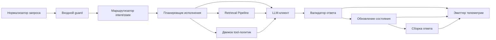

# C4 Component-диаграмма (`core`)

## Пояснения

- Планировщик может пропускать retrieval/tool-ноды для простых turn диалога.
- Валидатор ответа обязателен до persistence и выдачи ответа пользователю.
