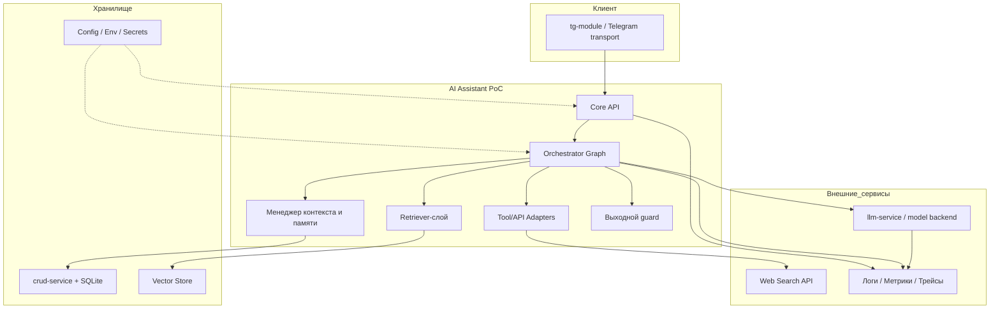

# C4 Container-диаграмма

## Пояснения

- `core` владеет всей логикой переходов и quality gates.
- Retrieval и tool-вызовы являются явными контейнерами исполнения, а не скрытыми деталями реализации.
