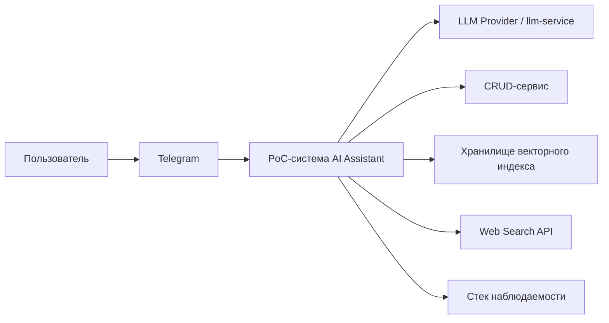

# C4 Context-диаграмма

## Пояснения

- Граница системы включает оркестрацию, retrieval, policy-проверки и формирование ответа.
- Внешние зависимости изолированы API-адаптерами и защищены timeout/retry-политиками.
