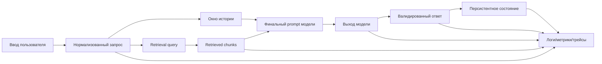

# Диаграмма потоков данных

## Хранимые и временные данные

- Хранимые: фаза state machine, структурированные поля профиля, компактная история, metadata решений.
- Transient: артефакты сборки prompt, промежуточные payload tools, сырые retrieval-кандидаты.
- Logged (redacted): latency, token usage, решения по веткам, причина fallback, результат guard.
