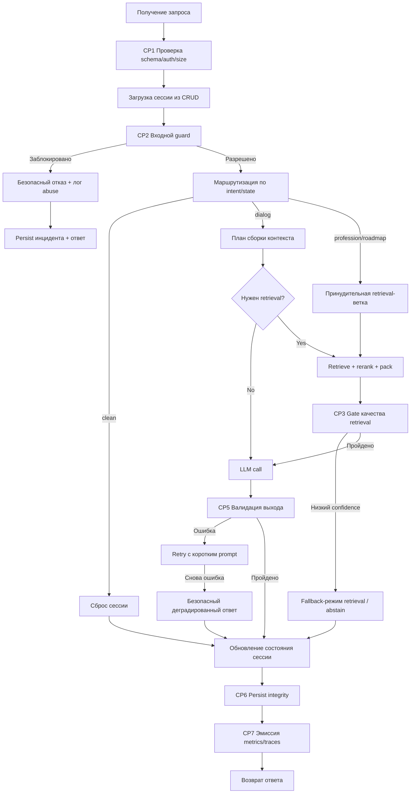

# Диаграмма Workflow / Graph

```mermaid
flowchart TD
    A[Получение запроса] --> B[CP1 Проверка schema/auth/size]
    B --> C[Загрузка сессии из CRUD]
    C --> D[CP2 Входной guard]
    D -->|Заблокировано| E[Безопасный отказ + лог abuse]
    E --> Z[Persist инцидента + ответ]

    D -->|Разрешено| F[Маршрутизация по intent/state]
    F -->|clean| G[Сброс сессии]
    F -->|dialog| H[План сборки контекста]
    F -->|profession/roadmap| I[Принудительная retrieval-ветка]

    H --> J{Нужен retrieval?}
    J -->|No| K[LLM call]
    J -->|Yes| L[Retrieve + rerank + pack]
    I --> L

    L --> M[CP3 Gate качества retrieval]
    M -->|Низкий confidence| N[Fallback-режим retrieval / abstain]
    M -->|Пройдено| K

    K --> O[CP5 Валидация выхода]
    O -->|Ошибка| P[Retry с коротким prompt]
    P -->|Снова ошибка| Q[Безопасный деградированный ответ]
    O -->|Пройдено| R[Обновление состояния сессии]

    G --> R
    N --> R
    Q --> R
    R --> S[CP6 Persist integrity]
    S --> T[CP7 Эмиссия metrics/traces]
    T --> U[Возврат ответа]
```

## Пояснения

- Ветки ошибок явные и наблюдаемые; silent failures не допускаются.
- Деградированные ответы допустимы только с зафиксированным reason code.
