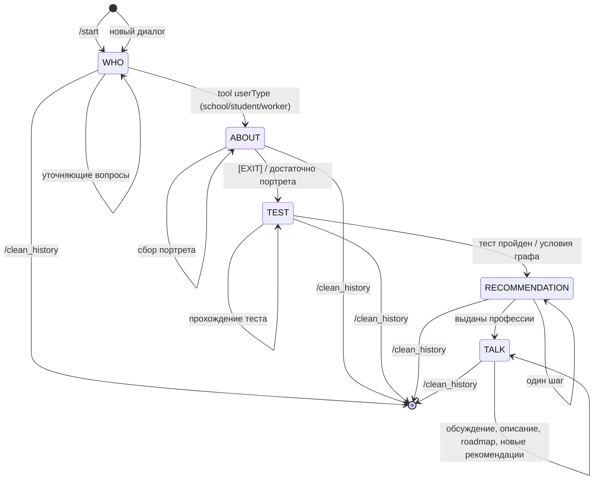

# Product Proposal: AI Gigaschool

## 1. Обоснование идеи — прикладная задача

**Задача:** автоматизировать первичную профориентацию через диалогового AI-консультанта, доступного в мессенджере (Telegram).

Пользователь получает единую точку входа: диалог собирает контекст (кто он, чем занимается, интересы), проводит или учитывает профориентационные тесты, выдаёт персональные рекомендации профессий и по запросу — детали по профессии и образовательные дорожные карты (курсы, программы). Всё без обязательного визита к консультанту и без ручного сбора разрозненных тестов и статей.

Ценность: снижение порога входа в профориентацию, связка «интересы → профессии → обучение» в одном потоке.

---

## 2. Цель и метрики успеха

### Цель проекта

Реализовать рабочий PoC диалогового профориентационного помощника с этапами: знакомство → сбор портрета → тест → рекомендации профессий → обсуждение и образовательные дорожные карты. Управление состояниями агента и переходами между этапами реализуется через **систему диалоговых графов Chatsky** (DeepPavlov): граф задаёт узлы (WHO, ABOUT, TEST, RECOMMENDATION, TALK) и допустимые переходы по условиям и результатам tool calls. На этой же архитектуре строятся защиты от prompt-injection, jailbreak и утечки системного промпта (см. [governance.md](governance.md)).

### Метрики успеха

| Категория | Метрика | Целевое значение (PoC) |
|-----------|---------|-------------------------|
| **Продуктовые** | Прохождение полного сценария (WHO → ABOUT → TEST → RECOMMENDATION → TALK) | Пользователь доходит до списка профессий и хотя бы одного запроса описания/roadmap |
| | Использование кнопок профессий и RAG (описание, roadmap) | Запросы выполняются без падений |
| **Агентские / качество диалога** | Корректное определение типа пользователя (school/student/worker) | Tool call `userType` возвращает осмысленный результат по диалогу WHO |
| | Релевантность рекомендаций | Рекомендации содержат профессии, хотя бы косвенно связанные с собранным портретом (качественная оценка на демо) |
| | Стабильность переходов между этапами | Переходы между узлами выполняются только по условиям диалогового графа; пользовательский ввод не переключает узел напрямую |
| **Безопасность (граф)** | Защита от prompt-injection / jailbreak / утечки системного промпта | Системный промпт привязан к узлу графа; в LLM не подаётся смешанный «система + пользователь»; переход в следующий узел — только по коду/условиям, не по тексту ответа LLM |
| **Технические** | Доступность API для бота | API агента отвечает на `/start_talk/`, эндпоинты RAG и `/clean_history/` доступны в контуре приложения |
| | Сохранение и очистка контекста | После `/clean_history` история и метаданные пользователя удаляются; при новом диалоге контекст не тянется от прошлой сессии |
| | Мониторинг | Метрики LLM (запросы, токены, длительность) доступны в Prometheus/Grafana |

---

## 3. Сценарии использования (включая edge-кейсы)

### Основные сценарии

1. **Школьник:** /start → представление (имя, возраст, класс) → диалог об интересах и планах → прохождение выбранного теста → получение списка профессий → запрос описания и roadmap по одной из профессий.
2. **Студент:** то же с акцентом на доп. образование, смену специализации, совмещение с текущей учёбой.
3. **Работающий:** смена карьеры — диалог о текущей работе, недовольстве, интересах и целях → тест → рекомендации → уточнение по профессиям и курсам.

### Edge-кейсы

- **Некорректный или уклончивый ввод (WHO/ABOUT):** бот не должен придумывать за пользователя данные; промпты предписывают уточняющие вопросы. Ожидание: система задаёт уточняющий вопрос, а не переходит к следующему этапу с выдуманными данными.
- **Смена типа пользователя в процессе:** после этапа WHO тип зафиксирован (school/student/worker). Явная смена типа в рамках PoC не предусмотрена — при необходимости пользователь может использовать `/clean_history` и начать заново.
- **Отказ от теста:** Отказ от прохождения или досрочный выход — граничный кейс; целевое поведение — либо завершение этапа с частичными данными, либо подсказка продолжить.
- **Запрос описания/roadmap по профессии не из рекомендаций:** бот показывает кнопки только по рекомендованным профессиям. RAG по произвольной профессии возможен при наличии её в индексе.
- **Очень длинный ввод / спам:** ограничения на длину сообщения со стороны Telegram; на стороне API — ограничение контекста и длины ответа LLM. Риск переполнения контекста — см. governance (лимиты, обрезка истории).
- **Повторный /cancel или /clean_history:** /cancel сбрасывает активность сессии; /clean_history вызывает API очистки — идемпотентно.
- **Недоступность внешних сервисов:** при падении LLM, RAG (FAISS) или веб-поиска (SearXNG/Tavily) пользователь получает ошибку в ответе; retry и fallback в PoC минимальны.

---

## 4. Ограничения

### Технические

- **Задержка (p95 latency):** ответ диалога зависит от LLM (обычно 2–10+ с); RAG и tool calls добавляют 1–5 с. Целевой ориентир для одного ответа в диалоге — до ~30 с в типичных условиях.
- **Доступность:** один инстанс Model API, один бот; отказ инстанса = недоступность сервиса.
- **Хранилище:** SQLite для истории и метаданных; при росте нагрузки потребуется миграция на СУБД и репликация.
- **Векторный поиск:** FAISS в памяти; объём данных ограничен размером индекса профессий и образовательных программ.
- **Лимиты провайдеров LLM:** квоты Yandex/OpenAI/Anthropic/Google; при превышении запросы будут падать (нужен мониторинг и при необходимости backoff/очереди).

### Операционные

- **Бюджет:** затраты на API LLM; для PoC предполагается ограниченный объём запросов и предсказуемый месячный лимит.
- **Поддержка:** ручное обновление индексов (профессии, курсы), обновление промптов и конфигурации без полноценного CI/CD.
- **Безопасность и соответствие:** см. [governance.md](governance.md) — логи, персональные данные, инъекции, подтверждение деструктивных действий.

---

## 5. Архитектурный набросок

### Модули и интеграции

| Модуль | Назначение | Интеграции |
|--------|------------|------------|
| **Диалоговый граф Chatsky** | Управление состояниями агента: узлы (WHO, ABOUT, TEST, RECOMMENDATION, TALK), переходы по условиям и результатам tools. Изоляция системного промпта по узлам; защита от prompt-injection, jailbreak, утечки системного промпта | Model API (граф исполняется в контуре модели) |
| **Telegram Bot (tg-module)** | Приём сообщений, команды, кнопки, вызов Model API | Model API (HTTP) |
| **Model API (model/)** | Оркестрация диалога по графу Chatsky, вызов LLM и тулов в рамках текущего узла | Chatsky (граф), LLM API (Yandex/OpenAI/Anthropic/Google), RAG, веб-поиск, репозиторий |
| **Хранилище (repo/)** | Хранение истории диалога и метаданных пользователя | SQLite (файл БД) |
| **Профессии (professions_vector_index/)** | FAISS-индекс по агрегату HH, семантический поиск | Yandex Embeddings |
| **Курсы (education/)** | Парсеры курсов, FAISS-индекс программ | Stepik, Поступи, Нетология, Skillfactory |
| **Веб-поиск (web_search/)** | SearXNG + Tavily-совместимый адаптер | Model API по HTTP |
| **Парсеры (parsers/)** | HH и др. — вакансии, агрегация профессий, суммаризация | HH API, локальные данные |

/*
### Диаграмма состояний бота (граф Chatsky)

Переходы между узлами задаются графом; смена состояния — только по условиям.

| Узел | Назначение |
|------|------------|
| **WHO** | Знакомство: имя, возраст, тип (школьник / студент / работающий); переход в ABOUT по tool `userType`. |
| **ABOUT** | Сбор портрета по типу; переход в TEST по маркеру [EXIT] / условию выхода. |
| **TEST** | Выбор и прохождение профориентационного теста; переход в RECOMMENDATION по условиям графа. |
| **RECOMMENDATION** | Формирование списка профессий (tool `make_json_tool`); переход в TALK после выдачи. |
| **TALK** | Обсуждение профессий, запрос описания/roadmap (RAG), при необходимости обновление рекомендаций (остаёмся в TALK). |

### Потоки данных

- **Пользователь → Бот → Model API → граф Chatsky → LLM / RAG / Tools:** сообщение пользователя уходит в `POST /start_talk/`; внутри Model текущий узел графа определяет, какой системный промпт и какие действия допустимы. Пользовательский ввод передаётся в LLM только как отдельное сообщение (human), не в составе системного промпта. Переход в следующий узел выполняется по условиям графа и результатам tool calls (например, `userType`, [EXIT]), а не по свободному тексту ответа LLM — это ограничивает prompt-injection и jailbreak.
- **Обратно:** текст ответа + опционально `professions` (для кнопок) и `test_info` (для теста v2) возвращаются в бота и отображаются пользователю.
- **Запрос описания/roadmap:** бот вызывает `POST /get_profession_info/` или `POST /get_profession_roadmap/`; Model API дергает RAG (FAISS + LLM для фильтрации/суммаризации) и возвращает текст и при необходимости обновлённый список профессий.

---

## 6. Data flow: что делегируется LLM/Agent, что нет

| Часть потока | Делегирование LLM/Agent | Не делегируется (жёсткая логика/данные) |
|--------------|-------------------------|------------------------------------------|
| Определение типа пользователя (school/student/worker) | Да | **Граф Chatsky:** переход WHO→ABOUT только по результату тула `userType`; узел WHO имеет фиксированный системный промпт; пользовательский ввод не меняет узел. Хранение состояния в графе и `user_state` |
| Сбор портрета (ABOUT) | Да — свободный диалог | **Граф Chatsky:** узел ABOUT с промптом по типу (school/student/worker); переход в TEST по условию выхода ([EXIT]). Системный промпт не смешивается с вводом пользователя |
| Выбор теста | Да — тул `select_test_tool` по портрету | Граф: узел TEST; список тестов из конфига; v1/v2 ветки (генерация вопросов vs заготовленные); переход в RECOMMENDATION по условию графа |
| Рекомендация профессий | Да — диалог | Граф: узел RECOMMENDATION → TALK после выдачи; формат выдачи (словарь), передача в бота для кнопок |
| Описание профессии (RAG) | Частично: LLM решает, подходит ли документ к профессии | FAISS-поиск по эмбеддингам; загрузка документов из индекса |
| Roadmap (курсы) | Частично: LLM решает, есть ли курсы для профессии (`is_docs_about_courses_tool`) | FAISS по образовательному индексу; структура данных курсов из education/ |
| Новая рекомендация в TALK | Да — tool `is_recommendation_tool` | Обновление `user_metadata['ai_recommendation_json']` |
| История и метаданные | Нет | Репозиторий (SQLite): сохранение/загрузка/очистка по `user_id`; при использовании Chatsky — сохранение текущего узла графа |
| Управление узлами и переходами графа | Нет | **Граф Chatsky:** переходы только по условиям и результатам тулов; системный промпт привязан к узлу и не подставляется из пользовательского ввода|
| Маршрутизация запросов бота | Нет | Бот по командам и callback решает, какой эндпоинт вызвать |
| Санитизация вывода в Telegram | Нет | `sanitize_text` в боте (разметка, ссылки) |

Итого: LLM/Agent отвечают за содержание диалога, классификации и структурированный вывод (профессии, тесты); **граф Chatsky** задаёт допустимые состояния и переходы, изолирует системный промпт по узлам и не даёт пользовательскому вводу менять узел или подмешиваться в системную инструкцию. Хранение, RAG-индексы, вызовы API и санитизация вывода остаются под контролем кода.
